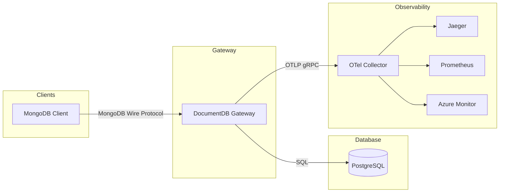

# OpenTelemetry Infrastructure for DocumentDB Gateway

## Overview

The DocumentDB gateway (`pg_documentdb_gw`) is a protocol translation layer that accepts MongoDB wire protocol connections and translates them to PostgreSQL queries. This enables MongoDB clients to interact with a PostgreSQL-based document database.

This document describes the OpenTelemetry (OTel) instrumentation added to the gateway.

## Goals

1. **Unified observability**: Export metrics, traces, and logs via OTLP to any compatible backend (Jaeger, Prometheus, Grafana, etc.)
2. **Request visibility**: Track request latency, throughput, and errors with operation-level granularity
3. **Distributed tracing**: Correlate client requests through the gateway to PostgreSQL for end-to-end debugging
4. **Vendor neutrality**: Use OpenTelemetry standards so operators can choose their observability stack

## Architecture



## Metrics

Metrics follow [OTel Database Client Semantic Conventions](https://opentelemetry.io/docs/specs/semconv/database/database-metrics/):

| Metric | Type | Unit | Description |
|--------|------|------|-------------|
| `db.client.operation.duration.total` | Counter | seconds | Sum of operation durations (divide by count for average) |
| `db.client.operations` | Counter | count | Number of operations |
| `db.client.request.size.total` | Counter | bytes | Sum of request payload sizes |
| `db.client.response.size.total` | Counter | bytes | Sum of response payload sizes |

**Attributes**: `db.system.name`, `db.operation.name`, `db.collection.name`, `db.namespace`, `error.type` (on failure)

**Note**: We use Counters (totals) instead of Histograms for low-memory overhead. Aggregation (averages, percentiles) is delegated to the collector/backend.

## Span Instrumentation

Request handling is instrumented to create spans with operation details:

```rust
#[tracing::instrument(
    skip_all,
    fields(activity_id, operation, db, collection)
)]
async fn handle_message<T>(...) { ... }
```

Span fields (`operation`, `db`, `collection`) are populated after request parsing.

## Adding Instrumentation

The gateway uses a **hierarchical span structure** where request details are captured once at the parent level:

### Request-Level Span (`handle_message`)

The main entry point in `src/lib.rs` creates a span with all request attributes:

```rust
#[tracing::instrument(
    skip_all,
    fields(
        activity_id = %activity_id,
        operation = tracing::field::Empty,
        db = tracing::field::Empty,
        collection = tracing::field::Empty,
        user_agent = tracing::field::Empty,
    )
)]
async fn handle_message<T>(...) {
    // Parse request...
    let request_info = request.extract_common()?;
    
    // Record operation details after parsing
    let current_span = tracing::Span::current();
    current_span.record("operation", request.request_type().to_string());
    current_span.record("db", request_info.db().unwrap_or(""));
    current_span.record("collection", request_info.collection().unwrap_or(""));
    current_span.record("user_agent", client_info.driver_description());
    // ...
}
```

**Key patterns:**
- `fields(... = tracing::field::Empty)` — Declare fields upfront, populate later after parsing
- `current_span.record(...)` — Fill in values once request content is known
- `skip_all` — Exclude all parameters (they're large and not useful as span attributes)
- `user_agent` — Captures MongoDB driver description for client identification

### Processor-Level Spans

Child spans in `src/processor/data_management.rs` use minimal instrumentation since they inherit context from the parent:

```rust
use tracing::instrument;

#[instrument(skip_all)]
pub async fn process_find(
    request_context: &RequestContext<'_>,
    connection_context: &ConnectionContext,
    pg_data_client: &impl PgDataClient,
) -> Result<Response> {
    // Implementation - this span is a child of handle_message
    // and inherits activity_id, operation, db, collection
}
```

**Why `skip_all` without fields?**
- The parent `handle_message` span already has `operation`, `db`, `collection`
- Child spans automatically inherit the trace context
- Adding redundant fields would bloat traces without adding value

### Adding Log Events

Use `tracing` macros for structured logging within spans:

```rust
use tracing::{info, debug, warn};

#[instrument(skip_all)]
pub async fn process_find(...) -> Result<Response> {
    debug!("Executing find query");
    
    let result = pg_data_client.execute_find(...).await;
    
    if let Err(ref e) = result {
        warn!(error = %e, "Find query failed");
    }
    
    info!(rows_returned = response.row_count(), "Find completed");
    result
}
```

Log events are automatically correlated with the current span and exported via OTLP.

## Context Propagation

MongoDB wire protocol doesn't support HTTP-style trace headers. To enable distributed tracing, we propagate W3C trace context via the MongoDB `comment` field (following the approach proposed by [FerretDB](https://blog.ferretdb.io/otel-context-propagation-in-ferretdb/)):

**MongoDB Client → Gateway:**
```javascript
db.collection.find({...}, {comment: '{"traceparent": "00-abc123-def456-01"}'})
```

**Gateway → PostgreSQL** (for log correlation):
```sql
/* traceparent='00-abc123-def456-01' */ SELECT documentdb_api.find(...)
```

### Why SQL Comments vs SET LOCAL

An alternative approach is using `SET LOCAL application_name` to propagate trace context:

```sql
BEGIN;
SET LOCAL application_name = 'trace-abc123';
SELECT documentdb_api.find(...);
COMMIT;
```

We chose SQL comments because `SET LOCAL` only works within explicit transaction blocks. Outside a transaction, it [has no effect](https://www.postgresql.org/docs/current/sql-set.html). Since many read operations (find, aggregate) execute as single statements without transactions, `SET LOCAL` would miss these traces. SQL comments work universally regardless of transaction state.

## Graceful Degradation

The gateway is designed to continue operating if telemetry initialization fails:

- **Init failure**: If `TelemetryManager::init_telemetry()` fails (e.g., OTel collector unreachable), the gateway logs an error via `eprintln!` and continues without telemetry. No metrics or traces are recorded, but request processing is unaffected.

- **Shutdown failure**: The shutdown process attempts to close all providers (tracer, meter, logger) even if one fails. The first error is returned after all shutdown attempts complete.

- **Pre-init logging**: Errors during telemetry setup use `eprintln!` instead of `tracing::error!` because the tracing subscriber isn't initialized yet.

This ensures observability issues never impact gateway availability.

## Configuration

Telemetry is configured with a **priority chain**: JSON config → environment variables → defaults.

### Configuration Priority

1. **SetupConfiguration.json** (highest priority) — Structured configuration for deployment
2. **Environment variables** — Fallbacks following OTel conventions  
3. **Defaults** — Sensible production defaults

This enables operators to use existing OTel environment variables while optionally overriding them with JSON configuration.

### JSON Configuration (SetupConfiguration.json)

The `TelemetryOptions` section in `SetupConfiguration.json` provides structured telemetry configuration:

```json
{
  "TelemetryOptions": {
    "ServiceName": "documentdb-gateway",
    "ServiceVersion": "1.0.0",
    "Tracing": {
      "Enabled": true,
      "OtlpEndpoint": "http://otel-collector:4317",
      "SamplingRatio": 0.1,
      "ExportIntervalMs": 5000,
      "MaxExportBatchSize": 512,
      "ExportTimeoutMs": 10000
    },
    "Metrics": {
      "Enabled": true,
      "OtlpEndpoint": "http://otel-collector:4317",
      "ExportIntervalMs": 60000,
      "ExportTimeoutMs": 10000
    },
    "Logging": {
      "Enabled": true,
      "OtlpEndpoint": "http://otel-collector:4317",
      "Level": "info",
      "ConsoleEnabled": false,
      "MaxQueueSize": 4096,
      "MaxExportBatchSize": 256,
      "ExportIntervalMs": 5000,
      "ExportTimeoutMs": 10000
    }
  }
}
```

All fields are optional. Missing fields fall back to environment variables, then defaults.

### Environment Variables

Environment variables follow OTel conventions and serve as fallbacks when JSON values are not specified:

| Variable | Default | Description |
|----------|---------|-------------|
| `OTEL_SERVICE_NAME` | `documentdb_gateway` | Service name |
| `OTEL_EXPORTER_OTLP_ENDPOINT` | `http://localhost:4317` | Base OTLP endpoint (gRPC) |
| `OTEL_TRACING_ENABLED` | `false` | Enable tracing |
| `OTEL_METRICS_ENABLED` | `true` | Enable metrics |
| `OTEL_LOGGING_ENABLED` | `true` | Enable log export |
| `OTEL_TRACES_SAMPLER_ARG` | `0.1` | Trace sampling ratio (10%) |
| `OTEL_METRIC_EXPORT_INTERVAL` | `15000` | Metrics export interval (ms) |
| `RUST_LOG` | `info` | Log level filter |

**Signal-specific endpoints**: Each telemetry signal can use a dedicated endpoint that falls back to the base endpoint:
- `OTEL_EXPORTER_OTLP_TRACES_ENDPOINT` → `OTEL_EXPORTER_OTLP_ENDPOINT`
- `OTEL_EXPORTER_OTLP_METRICS_ENDPOINT` → `OTEL_EXPORTER_OTLP_ENDPOINT`
- `OTEL_EXPORTER_OTLP_LOGS_ENDPOINT` → `OTEL_EXPORTER_OTLP_ENDPOINT`

### Configuration Examples

**Production with JSON config:**
```json
{
  "TelemetryOptions": {
    "Tracing": { "SamplingRatio": 0.01 },
    "Metrics": { "ExportIntervalMs": 30000 }
  }
}
```

**Env-only (no JSON section):**
```bash
# When TelemetryOptions is omitted from JSON, env vars are used
export OTEL_TRACES_SAMPLER_ARG=1.0
```

**Backward compatibility (env-only):**
```bash
# Works without any JSON config
export OTEL_EXPORTER_OTLP_ENDPOINT=http://collector:4317
export OTEL_TRACES_SAMPLER_ARG=0.5
```

### Log Level Configuration

`RUST_LOG` (or `TelemetryOptions.Logging.Level` in JSON) controls filtering for both log events (`info!`, `debug!`) and tracing spans (`#[instrument]`). They share the same `tracing-subscriber` with a single `EnvFilter`. Examples:
- `info` — Info level for all crates
- `documentdb_gateway=debug` — Debug for gateway, default for others
- `documentdb_gateway=trace,tokio=warn` — Fine-grained control

**Performance note:** Trace sampling defaults to 10% to minimize overhead in production. Adjust via `TelemetryOptions.Tracing.SamplingRatio` or `OTEL_TRACES_SAMPLER_ARG` based on your traffic volume and observability needs.

## Module Structure

```
src/telemetry/
├── mod.rs                 # Public exports
├── config.rs              # Shared config (TelemetryOptions/Config, helpers)
├── telemetry_manager.rs   # Initializes and shuts down OTel providers
├── tracing.rs             # TracingOptions/Config + TracerProvider setup
├── metrics.rs             # MetricsOptions/Config + MeterProvider + OtelTelemetryProvider
├── logging.rs             # LoggingOptions/Config + LoggerProvider setup
├── context_propagation.rs # W3C trace context extraction/injection
├── client_info.rs         # MongoDB client metadata parsing
└── event_id.rs            # Telemetry event identifiers
```

### Config Module Design


**Shared config** (`config.rs`):
- `TelemetryOptions`, `TelemetryConfig` — Top-level aggregation
- Helper functions: `env_or()`, `json_or_env_or()`, `parse_resource_attributes()`

**Signal-specific config** (in respective modules):
- `tracing.rs`: `TracingOptions`, `TracingConfig`
- `metrics.rs`: `MetricsOptions`, `MetricsConfig`  
- `logging.rs`: `LoggingOptions`, `LoggingConfig`

**Constructor pattern:**
```rust
// Primary constructor: JSON config with env fallback
let config = TelemetryConfig::from_config(setup_config.telemetry_options());

// Legacy constructor: env-only (for backward compatibility)
let config = TelemetryConfig::from_env();
```

Each config struct uses `from_config(Option<&*Options>)` which resolves values via:
1. JSON value (if present)
2. Environment variable (if set)
3. Default constant

## Testing Locally

1. Start the infrastructure:

```yaml
# docker-compose.yml
services:
  otel-collector:
    image: otel/opentelemetry-collector-contrib:latest
    command: ["--config=/etc/otel-collector-config.yaml"]
    ports:
      - "4317:4317"   # OTLP gRPC
      - "4318:4318"   # OTLP HTTP
      - "8889:8889"   # Prometheus metrics endpoint
    volumes:
      - ./otel-collector-config.yaml:/etc/otel-collector-config.yaml
    depends_on:
      - tempo
      - loki
      - prometheus

  tempo:
    image: grafana/tempo:latest
    command: ["-config.file=/etc/tempo.yaml"]
    ports:
      - "3200:3200"
    volumes:
      - ./tempo.yaml:/etc/tempo.yaml

  loki:
    image: grafana/loki:latest
    command: ["-config.file=/etc/loki/local-config.yaml"]
    ports:
      - "3100:3100"
    volumes:
      - ./loki.yaml:/etc/loki/local-config.yaml

  prometheus:
    image: prom/prometheus:latest
    command:
      - "--config.file=/etc/prometheus/prometheus.yml"
      - "--web.enable-remote-write-receiver"
    ports:
      - "9090:9090"
    volumes:
      - ./prometheus.yaml:/etc/prometheus/prometheus.yml

  grafana:
    image: grafana/grafana:latest
    ports:
      - "3000:3000"
    environment:
      - GF_AUTH_ANONYMOUS_ENABLED=true
      - GF_AUTH_ANONYMOUS_ORG_ROLE=Admin
```

```yaml
# otel-collector-config.yaml
receivers:
  otlp:
    protocols:
      grpc:
        endpoint: 0.0.0.0:4317
      http:
        endpoint: 0.0.0.0:4318

exporters:
  otlp/tempo:
    endpoint: tempo:4317
    tls:
      insecure: true
  otlphttp/loki:
    endpoint: http://loki:3100/otlp
  prometheus:
    endpoint: "0.0.0.0:8889"
  debug:
    verbosity: basic

service:
  pipelines:
    traces:
      receivers: [otlp]
      exporters: [otlp/tempo, debug]
    metrics:
      receivers: [otlp]
      exporters: [prometheus, debug]
    logs:
      receivers: [otlp]
      exporters: [otlphttp/loki, debug]
```

2. Start the gateway with telemetry pointing at the collector:

```bash
export OTEL_EXPORTER_OTLP_ENDPOINT=http://localhost:4317
export OTEL_TRACING_ENABLED=true
export OTEL_TRACES_SAMPLER_ARG=1.0  # 100% sampling for local testing
```

3. Send requests via a MongoDB client

4. Verify traces in Grafana Tempo (`http://localhost:3000` → Explore → Tempo):
   - Search for `service.name = documentdb_gateway`
   - Look for `handle_message` spans with `operation`, `db`, `collection`, `user_agent` attributes

5. Verify logs in Grafana Loki (`http://localhost:3000` → Explore → Loki):
   - Query: `{service_name="documentdb_gateway"}`

6. Verify metrics in Prometheus (`http://localhost:9090`):
   - Query: `sum by (db_operation_name) (rate(db_client_operations_total[1m]))`

## OTLP Backend Compatibility

The OTLP exporter works with:
- OpenTelemetry Collector
- Jaeger, Grafana Tempo (traces)
- Prometheus via OTel Collector (metrics)
- Elastic APM, Azure Monitor, Datadog, New Relic

## Performance Considerations

**Sampling strategy**: Trace sampling defaults to 10% (`OTEL_TRACES_SAMPLER_ARG=0.1`) using parent-based sampling. This means:
- Root spans (no incoming trace context): sampled at 10%
- Child spans (client provides traceparent): honors the client's sampling decision

**Per-request overhead**:

| Component | Unsampled (90%) | Sampled (10%) |
|-----------|-----------------|---------------|
| Span context check | 2 boolean checks | 2 boolean checks |
| SQL trace comment | Zero-copy (`Cow::Borrowed`) | 1 string allocation |
| Metrics recording | Always runs | Always runs |
| OTLP export | None | Batched async |

**PostgreSQL prepared statement caching**: When sampled, SQL queries include a unique trace ID comment, creating separate cache entries. With 10% sampling, this has minimal impact on cache hit rates.

**Recommendations**:
- For high-throughput production: keep sampling at 1-10%
- For debugging: temporarily increase to 100% (`OTEL_TRACES_SAMPLER_ARG=1.0`)
- Metrics are always collected (low overhead) regardless of trace sampling
