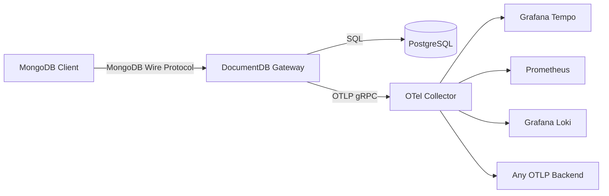

# OpenTelemetry for DocumentDB Gateway

The DocumentDB gateway exports metrics, traces, and logs via [OpenTelemetry](https://opentelemetry.io/) (OTLP), enabling you to monitor request latency, throughput, errors, and distributed traces using any compatible backend.

## Architecture



The gateway sends all three signals (traces, metrics, logs) over OTLP gRPC to a collector, which routes them to your chosen backends. Compatible backends include Grafana Tempo, Jaeger, Prometheus, Loki, Elastic APM, Azure Monitor, Datadog, and New Relic.

## Configuration

Telemetry is configured via environment variables or `SetupConfiguration.json`. When both are present, JSON takes priority.

### Environment Variables

| Variable | Default | Description |
|----------|---------|-------------|
| `OTEL_EXPORTER_OTLP_ENDPOINT` | `http://localhost:4317` | OTLP endpoint (gRPC) |
| `OTEL_SERVICE_NAME` | `documentdb_gateway` | Service name in traces/metrics |
| `OTEL_TRACING_ENABLED` | `false` | Enable distributed tracing |
| `OTEL_METRICS_ENABLED` | `true` | Enable metrics export |
| `OTEL_LOGGING_ENABLED` | `true` | Enable log export via OTLP |
| `OTEL_LOGS_CONSOLE_ENABLED` | `true` | Enable console (stdout) logging |
| `OTEL_TRACES_SAMPLER_ARG` | `0.1` | Trace sampling ratio (0.0–1.0) |
| `OTEL_METRIC_EXPORT_INTERVAL` | `15000` | Metrics export interval (ms) |
| `RUST_LOG` | `info` | Log level (`error`, `warn`, `info`, `debug`, `trace`) |

Each signal can also use a dedicated endpoint that falls back to the base endpoint:

- `OTEL_EXPORTER_OTLP_TRACES_ENDPOINT` → `OTEL_EXPORTER_OTLP_ENDPOINT`
- `OTEL_EXPORTER_OTLP_METRICS_ENDPOINT` → `OTEL_EXPORTER_OTLP_ENDPOINT`
- `OTEL_EXPORTER_OTLP_LOGS_ENDPOINT` → `OTEL_EXPORTER_OTLP_ENDPOINT`

### JSON Configuration (SetupConfiguration.json)

Add a `TelemetryOptions` section. All fields are optional — missing values fall back to environment variables, then defaults.

```json
{
  "TelemetryOptions": {
    "ServiceName": "documentdb-gateway",
    "Tracing": {
      "Enabled": true,
      "OtlpEndpoint": "http://otel-collector:4317",
      "SamplingRatio": 0.1,
      "ExportIntervalMs": 5000,
      "MaxExportBatchSize": 512,
      "ExportTimeoutMs": 10000
    },
    "Metrics": {
      "Enabled": true,
      "OtlpEndpoint": "http://otel-collector:4317",
      "ExportIntervalMs": 15000,
      "ExportTimeoutMs": 10000
    },
    "Logging": {
      "Enabled": true,
      "OtlpEndpoint": "http://otel-collector:4317",
      "Level": "info",
      "ConsoleEnabled": false,
      "MaxQueueSize": 4096,
      "MaxExportBatchSize": 256,
      "ExportIntervalMs": 5000,
      "ExportTimeoutMs": 10000
    }
  }
}
```

### Examples

**Enable all signals with environment variables:**
```bash
export OTEL_EXPORTER_OTLP_ENDPOINT=http://collector:4317
export OTEL_TRACING_ENABLED=true
export OTEL_TRACES_SAMPLER_ARG=1.0  # 100% sampling for debugging
```

**Production JSON (low sampling, longer metric intervals):**
```json
{
  "TelemetryOptions": {
    "Tracing": { "Enabled": true, "SamplingRatio": 0.01 },
    "Metrics": { "ExportIntervalMs": 30000 }
  }
}
```

### Log Level

`RUST_LOG` (or `TelemetryOptions.Logging.Level`) controls log verbosity. Examples:

- `info` — Info level for all crates (default)
- `documentdb_gateway=debug` — Debug for gateway, info for everything else
- `documentdb_gateway=trace,tokio=warn` — Fine-grained per-crate control

## Metrics

Metrics follow the [OTel Database Client Semantic Conventions](https://opentelemetry.io/docs/specs/semconv/database/database-metrics/):

| Metric | Type | Unit | Description |
|--------|------|------|-------------|
| `db.client.operation.duration.total` | Counter | seconds | Total operation duration |
| `db.client.operations` | Counter | count | Number of operations |
| `db.client.request.size.total` | Counter | bytes | Total request payload size |
| `db.client.response.size.total` | Counter | bytes | Total response payload size |

Each metric includes the following attributes:

| Attribute | Description |
|-----------|-------------|
| `db.system.name` | Always `documentdb` |
| `db.operation.name` | Operation type (e.g., `find`, `insert`, `aggregate`) |
| `db.collection.name` | Target collection |
| `db.namespace` | Database name |
| `error.type` | Error code (only present on failure) |

**Example Prometheus queries:**
```promql
# Operations per second by type
sum by (db_operation_name) (rate(db_client_operations_total[1m]))

# Average latency by operation
sum by (db_operation_name) (rate(db_client_operation_duration_seconds_total[1m]))
  / sum by (db_operation_name) (rate(db_client_operations_total[1m]))
```

## Traces

Each request creates a `handle_message` span with the following attributes:

| Attribute | Description |
|-----------|-------------|
| `activity_id` | Unique request identifier |
| `operation` | MongoDB operation (e.g., `find`, `insert`) |
| `db` | Target database |
| `collection` | Target collection |
| `user_agent` | MongoDB driver description |

Child spans are created for internal processing steps (query execution, cursor management, etc.) and automatically inherit the trace context.

### Distributed Trace Context

MongoDB wire protocol doesn't support HTTP-style trace headers. To enable end-to-end tracing, the gateway supports W3C trace context propagation via the MongoDB `comment` field. The comment can be either a BSON document or a JSON string:

**1. Client passes trace context in the comment (BSON document — recommended):**
```javascript
db.collection.find(
  { status: "active" },
  { comment: { traceparent: "00-abc123def456-789abc-01" } }
)
```

**Or as a JSON string (also supported):**
```javascript
db.collection.find(
  { status: "active" },
  { comment: '{"traceparent": "00-abc123def456-789abc-01"}' }
)
```

**2. Gateway extracts the context, creates a child span, and forwards it to PostgreSQL via SQL comments:**
```sql
/* traceparent='00-abc123def456-789abc-01' */ SELECT documentdb_api.find(...)
```

This enables correlated traces from client → gateway → PostgreSQL when using tools like Grafana Tempo.

## Reliability

Telemetry never impacts gateway availability:

- If the OTel collector is unreachable at startup, the gateway logs a warning and continues without telemetry.
- If the collector becomes unavailable at runtime, export batches are dropped without affecting request processing.
- Metrics and logs are enabled by default; tracing is opt-in (`OTEL_TRACING_ENABLED=false` by default).
- Console logging is enabled by default (`OTEL_LOGS_CONSOLE_ENABLED=true`), so the gateway always writes logs to stdout even without a collector. OTLP log export is additive — when enabled, logs are sent to both the console and the collector.

## Testing Locally

1. Start an observability stack with an OTel Collector, trace backend (e.g., Tempo), log backend (e.g., Loki), metrics backend (e.g., Prometheus), and visualization (e.g., Grafana). A minimal docker-compose setup:

```yaml
# docker-compose.yml
services:
  otel-collector:
    image: otel/opentelemetry-collector-contrib:latest
    command: ["--config=/etc/otel-collector-config.yaml"]
    ports:
      - "4317:4317"   # OTLP gRPC
      - "4318:4318"   # OTLP HTTP
      - "8889:8889"   # Prometheus metrics
    volumes:
      - ./otel-collector-config.yaml:/etc/otel-collector-config.yaml
    depends_on: [tempo, loki, prometheus]

  tempo:
    image: grafana/tempo:latest
    command: ["-config.file=/etc/tempo.yaml"]
    ports: ["3200:3200"]
    volumes: [./tempo.yaml:/etc/tempo.yaml]

  loki:
    image: grafana/loki:latest
    command: ["-config.file=/etc/loki/local-config.yaml"]
    ports: ["3100:3100"]
    volumes: [./loki.yaml:/etc/loki/local-config.yaml]

  prometheus:
    image: prom/prometheus:latest
    command: ["--config.file=/etc/prometheus/prometheus.yml", "--web.enable-remote-write-receiver"]
    ports: ["9090:9090"]
    volumes: [./prometheus.yaml:/etc/prometheus/prometheus.yml]

  grafana:
    image: grafana/grafana:latest
    ports: ["3000:3000"]
    environment:
      - GF_AUTH_ANONYMOUS_ENABLED=true
      - GF_AUTH_ANONYMOUS_ORG_ROLE=Admin
```

```yaml
# otel-collector-config.yaml
receivers:
  otlp:
    protocols:
      grpc: { endpoint: 0.0.0.0:4317 }
      http: { endpoint: 0.0.0.0:4318 }
exporters:
  otlp/tempo: { endpoint: tempo:4317, tls: { insecure: true } }
  otlphttp/loki: { endpoint: "http://loki:3100/otlp" }
  prometheus: { endpoint: "0.0.0.0:8889" }
service:
  pipelines:
    traces: { receivers: [otlp], exporters: [otlp/tempo] }
    metrics: { receivers: [otlp], exporters: [prometheus] }
    logs: { receivers: [otlp], exporters: [otlphttp/loki] }
```

2. Start the gateway with telemetry enabled:

```bash
export OTEL_EXPORTER_OTLP_ENDPOINT=http://localhost:4317
export OTEL_TRACING_ENABLED=true
export OTEL_TRACES_SAMPLER_ARG=1.0  # 100% sampling for local testing
```

3. Send requests via a MongoDB client.

4. View results in Grafana (`http://localhost:3000`):
   - **Tempo**: Search for `service.name = documentdb_gateway` to see traces
   - **Loki**: Query `{service_name="documentdb_gateway"}` for logs
   - **Prometheus**: Query `rate(db_client_operations_total[1m])` for metrics

## Performance Considerations

Trace sampling defaults to 10% using parent-based sampling:

- **Root spans** (no incoming trace context): sampled at the configured ratio
- **Child spans** (client provides `traceparent`): honors the client's sampling decision

| Component | Unsampled | Sampled |
|-----------|-----------|---------|
| Span context check | 2 boolean checks | 2 boolean checks |
| SQL trace comment | None | 1 string allocation |
| Metrics recording | Always | Always |
| OTLP export | None | Batched async |

When sampled, SQL queries include a unique trace ID in the comment, creating separate prepared statement cache entries. At the default 10% sampling, this has minimal impact on cache hit rates.

**Recommendations:**

- **Production**: Keep sampling at 1–10% (`OTEL_TRACES_SAMPLER_ARG=0.01` to `0.1`)
- **Debugging**: Temporarily increase to 100% (`OTEL_TRACES_SAMPLER_ARG=1.0`)
- Metrics are always collected regardless of trace sampling
