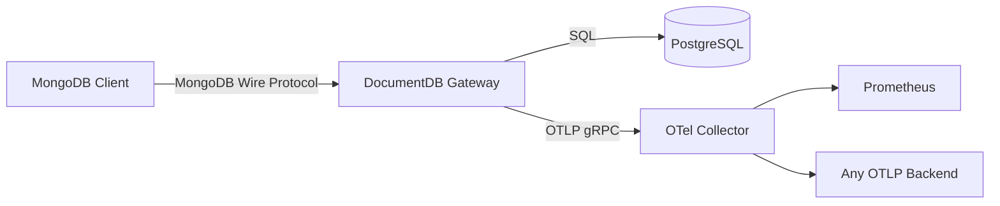

# OpenTelemetry Metrics for DocumentDB Gateway

The DocumentDB gateway exports metrics via [OpenTelemetry](https://opentelemetry.io/) (OTLP), enabling you to monitor request latency, throughput, and errors using any compatible backend.

> **Note:** Distributed tracing and OTLP log export will be added in follow-up PRs.

## Architecture


```mermaid
flowchart LR
    MC[MongoDB Client] -->|MongoDB Wire Protocol| DG[DocumentDB Gateway]
    DG -->|SQL| PG[(PostgreSQL)]
    DG -->|OTLP gRPC| OC[OTel Collector]
    OC --> Prometheus
    OC --> Other[Any OTLP Backend]
```

The gateway sends metrics over OTLP gRPC to a collector, which routes them to your chosen backend. Compatible backends include Prometheus, Grafana, Azure Monitor, Datadog, New Relic, and any OTLP-compatible system.

## Configuration

Metrics are configured via environment variables or `SetupConfiguration.json`. When both are present, JSON takes priority.

### Environment Variables

| Variable | Default | Description |
|----------|---------|-------------|
| `OTEL_EXPORTER_OTLP_ENDPOINT` | `http://localhost:4317` | OTLP endpoint (gRPC) |
| `OTEL_EXPORTER_OTLP_METRICS_ENDPOINT` | Falls back to above | Metrics-specific endpoint |
| `OTEL_SERVICE_NAME` | `documentdb_gateway` | Service name in metrics |
| `OTEL_METRICS_ENABLED` | `true` | Enable/disable metrics export |
| `OTEL_METRIC_EXPORT_INTERVAL` | `15000` | Metrics export interval (ms) |
| `OTEL_EXPORTER_OTLP_METRICS_TIMEOUT` | `10000` | Export timeout (ms) |

### JSON Configuration (SetupConfiguration.json)

Add a `TelemetryOptions` section. All fields are optional — missing values fall back to environment variables, then defaults.

```json
{
  "TelemetryOptions": {
    "ServiceName": "documentdb-gateway",
    "Metrics": {
      "Enabled": true,
      "OtlpEndpoint": "http://otel-collector:4317",
      "ExportIntervalMs": 15000,
      "ExportTimeoutMs": 10000
    }
  }
}
```

### Examples

**Enable metrics with environment variables:**
```bash
export OTEL_EXPORTER_OTLP_ENDPOINT=http://collector:4317
export OTEL_METRICS_ENABLED=true
```

**Production JSON (longer export interval):**
```json
{
  "TelemetryOptions": {
    "Metrics": { "ExportIntervalMs": 30000 }
  }
}
```

## Metrics

Metrics follow the [OTel Database Client Semantic Conventions](https://opentelemetry.io/docs/specs/semconv/database/database-metrics/):

| Metric | Type | Unit | Description |
|--------|------|------|-------------|
| `db.client.operation.duration.total` | Counter | seconds | Total operation duration |
| `db.client.operations` | Counter | count | Number of operations |
| `db.client.request.size.total` | Counter | bytes | Total request payload size |
| `db.client.response.size.total` | Counter | bytes | Total response payload size |

Each metric includes the following attributes:

| Attribute | Description |
|-----------|-------------|
| `db.system.name` | Always `documentdb` |
| `db.operation.name` | Operation type (e.g., `find`, `insert`, `aggregate`) |
| `db.collection.name` | Target collection |
| `db.namespace` | Database name |
| `error.type` | Error code (only present on failure) |

**Example Prometheus queries:**
```promql
# Operations per second by type
sum by (db_operation_name) (rate(db_client_operations_total[1m]))

# Average latency by operation
sum by (db_operation_name) (rate(db_client_operation_duration_seconds_total[1m]))
  / sum by (db_operation_name) (rate(db_client_operations_total[1m]))
```

## Reliability

Metrics never impact gateway availability:

- If the OTel collector is unreachable at startup, the gateway logs a warning and continues without metrics.
- If the collector becomes unavailable at runtime, export batches are dropped without affecting request processing.
- Metrics are enabled by default. When no `MeterProvider` is registered, all counter operations are no-ops with negligible overhead.

## Testing Locally

1. Start an OTel Collector and Prometheus:

```yaml
# docker-compose.yml
services:
  otel-collector:
    image: otel/opentelemetry-collector-contrib:latest
    command: ["--config=/etc/otel-collector-config.yaml"]
    ports:
      - "4317:4317"
      - "8889:8889"
    volumes:
      - ./otel-collector-config.yaml:/etc/otel-collector-config.yaml

  prometheus:
    image: prom/prometheus:latest
    command: ["--config.file=/etc/prometheus/prometheus.yml", "--web.enable-remote-write-receiver"]
    ports: ["9090:9090"]
    volumes: [./prometheus.yaml:/etc/prometheus/prometheus.yml]

  grafana:
    image: grafana/grafana:latest
    ports: ["3000:3000"]
    environment:
      - GF_AUTH_ANONYMOUS_ENABLED=true
      - GF_AUTH_ANONYMOUS_ORG_ROLE=Admin
```

```yaml
# otel-collector-config.yaml
receivers:
  otlp:
    protocols:
      grpc: { endpoint: 0.0.0.0:4317 }
exporters:
  prometheus: { endpoint: "0.0.0.0:8889" }
service:
  pipelines:
    metrics: { receivers: [otlp], exporters: [prometheus] }
```

2. Start the gateway with metrics enabled:

```bash
export OTEL_EXPORTER_OTLP_ENDPOINT=http://localhost:4317
export OTEL_METRICS_ENABLED=true
```

3. Send requests via a MongoDB client.

4. View metrics in Grafana (`http://localhost:3000`) or query Prometheus directly (`http://localhost:9090`):
   - Query `rate(db_client_operations_total[1m])` for throughput
   - Query `db_client_operation_duration_seconds_total` for latency totals
